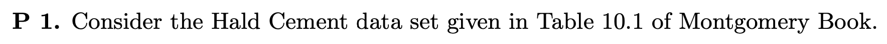

# Setup

```{r, message=FALSE}
library(MPV)      # Dataset
library(MASS)      # For stepwise selection
library(leaps)     # For subset selection
library(car)       # For PRESS statistic calculation
library(stats)     # For AIC and BIC calculation

```

# Problem 1



Load the Dataset

```{r}
data(cement)
data <- cement
```

Define the full model

```{r}
# Full model with all predictors
full_model <- lm(y ~ x1 + x2 + x3 + x4, data=data)
```

## Part (i) : Subset Models Selection Based on Different Criteria


### (a) $R^2$

```{r}
# (a) & (b): R-squared and Adjusted R-squared based models using regsubsets
subset_models <- regsubsets(y ~ x1 + x2 + x3 + x4, data=data, nbest=1)
subset_summary <- summary(subset_models)

# Select models based on R² and Adjusted R²
best_r2_model <- which.max(subset_summary$rsq)

best_r2_formula <- paste("y ~", paste(names(coef(subset_models, best_r2_model))[-1], collapse=" + "))

best_r2_formula

```

### (b) ${R_p}^2$

```{r}
best_adj_r2_model <- which.max(subset_summary$adjr2)
best_adj_r2_formula <- paste("y ~", paste(names(coef(subset_models, best_adj_r2_model))[-1], collapse=" + "))

best_adj_r2_formula
```

### (c) Mallow $C_p$ Statistics

```{r}

# (c): Mallow's Cp statistic
best_cp_model <- which.min(subset_summary$cp)

best_cp_formula <- paste("y ~", paste(names(coef(subset_models, best_cp_model))[-1], collapse=" + "))

best_cp_formula

```

### (d) Forward selection

```{r}
null_model <- lm(y ~ 1, data=data)

# Forward Selection
forward_model <- step(null_model, direction="forward", scope=formula(full_model), trace=FALSE)

forward_model


```

### (e) Backward Elimination

```{r}
# Backward Elimination
backward_model <- step(full_model, direction="backward", trace=FALSE)

backward_model
```

### (f) Stepwise Selection

```{r}
# Stepwise Selection
stepwise_model <- step(null_model, direction="both", scope=formula(full_model), trace=FALSE)
stepwise_model
```

## Part (ii) : Compute PRESS, AIC, and BIC for selected subset models


### (a) PRESS Statistics

```{r}
# Define function for PRESS statistic
PRESS <- function(model) {
  pr <- residuals(model)/(1 - lm.influence(model)$hat)
  sum(pr^2)
}

# Fit the selected models
model_r2 <- lm(best_r2_formula, data=data)
model_adj_r2 <- lm(best_adj_r2_formula, data=data)
model_cp <- lm(best_cp_formula, data=data)

# PRESS statistic
press_r2 <- PRESS(model_r2)
press_adj_r2 <- PRESS(model_adj_r2)
press_cp <- PRESS(model_cp)

```

### (b) AIC

```{r}
aic_r2 <- AIC(model_r2)
aic_adj_r2 <- AIC(model_adj_r2)
aic_cp <- AIC(model_cp)


```

### (c) BIC

```{r}
bic_r2 <- BIC(model_r2)
bic_adj_r2 <- BIC(model_adj_r2)
bic_cp <- BIC(model_cp)
```

Output the Results

```{r, results = 'hold'}
cat("Model based on R-squared:\n")
cat("Formula:", best_r2_formula, "\n")
cat("PRESS:", press_r2, "\n")
cat("AIC:", aic_r2, "\n")
cat("BIC:", bic_r2, "\n\n")

cat("Model based on Adjusted R-squared:\n")
cat("Formula:", best_adj_r2_formula, "\n")
cat("PRESS:", press_adj_r2, "\n")
cat("AIC:", aic_adj_r2, "\n")
cat("BIC:", bic_adj_r2, "\n\n")

cat("Model based on Mallow's Cp:\n")
cat("Formula:", best_cp_formula, "\n")
cat("PRESS:", press_cp, "\n")
cat("AIC:", aic_cp, "\n")
cat("BIC:", bic_cp, "\n\n")

cat("Forward Selection Model:\n")
cat("Formula:", as.character(forward_model$call$formula), "\n")
cat("PRESS:", PRESS(forward_model), "\n")
cat("AIC:", AIC(forward_model), "\n")
cat("BIC:", BIC(forward_model), "\n\n")

cat("Backward Elimination Model:\n")
cat("Formula:", as.character(backward_model$call$formula), "\n")
cat("PRESS:", PRESS(backward_model), "\n")
cat("AIC:", AIC(backward_model), "\n")
cat("BIC:", BIC(backward_model), "\n\n")

cat("Stepwise Selection Model:\n")
cat("Formula:", as.character(stepwise_model$call$formula), "\n")
cat("PRESS:", PRESS(stepwise_model), "\n")
cat("AIC:", AIC(stepwise_model), "\n")
cat("BIC:", BIC(stepwise_model), "\n")
```
